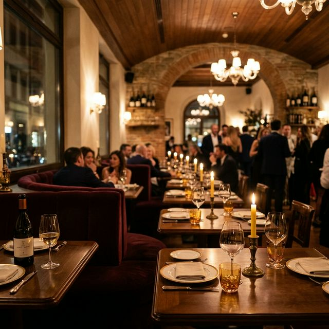

# Rapito – Premium Italian Restaurant Website


Rapito is a high-end portfolio project designed to showcase a modern, luxury dining experience. Built with a focus on premium UI/UX, smooth animations, and a responsive mobile-first approach, it simulates a real-world client website for an authentic Italian ristorante in Mayfair, London.

---

## 🌟 Key Features

- **Modern Responsive Design**: Fully optimized for mobile, tablet, and desktop views.
- **Premium UI/UX**: Custom-tailored aesthetics using a sophisticated color palette (Charcoal, Gold, and Cream).
- **Interactive Reservation System**: A functional frontend booking form with real-time validation and submission states.
- **Immersive Animations**: Smooth scroll-reveal effects and hover interactions built with Intersection Observer and Tailwind CSS.
- **Optimized Performance**: Leverages Next.js 15+ features for fast loading and SEO readiness.

---

## 🛠 Tech Stack

- **Framework**: [Next.js 16 (App Router)](https://nextjs.org/)
- **Styling**: [Tailwind CSS 4](https://tailwindcss.com/)
- **Typography**: [Google Fonts](https://fonts.google.com/) (Playfair Display & Inter)
- **Icons/Graphics**: Custom SVG icons and AI-generated imagery.
- **Language**: TypeScript / JavaScript (React 19)

---

## 📸 Screenshots

> [!NOTE]
> Add your own project screenshots here to make it truly personal.

### Desktop View

*Immersive hero section with glassmorphism effects.*

### Menu Section
*Elegant menu layout with categorized Italian delicacies.*

### Reservation Form
*Clean, validated booking interface for a seamless user experience.*

---

## 🚀 Live Demo

[Visit Live Site (Placeholder)](https://rapito-ristorante.vercel.app)

---

## 📦 Getting Started

### Prerequisites

- Node.js 18.x or later
- npm or yarn

### Installation

1. Clone the repository:
   ```bash
   git clone https://github.com/your-username/rapito.git
   ```
2. Navigate to the project directory:
   ```bash
   cd rapito
   ```
3. Install dependencies:
   ```bash
   npm install
   ```
4. Start the development server:
   ```bash
   npm run dev
   ```
5. Open [http://localhost:3000](http://localhost:3000) in your browser.

---

## 📂 Project Structure

- `/app`: Next.js App Router for routing and layout.
- `/components/ui`: Reusable primitive UI components (Buttons, Cards, etc.).
- `/sections`: Large-scale page sections (Hero, About, Menu, Reservation).
- `/lib`: Utility functions and static data.
- `/hooks`: Custom React hooks (e.g., `useScrollReveal`).
- `/public`: Optimized images and assets.

---

## 🔮 Future Improvements

- **Backend Integration**: Connecting the reservation system to a database (Prisma/PostgreSQL).
- **CMS Integration**: Adding a headless CMS (Sanity/Contentful) for dynamic menu management.
- **Multi-language Support**: i18n support for international guests.

---

## 👤 Author

**Your Name**
- Portfolio: [yourportfolio.com](https://yourportfolio.com)
- LinkedIn: [linkedin.com/in/yourname](https://linkedin.com/in/yourname)

---

## 📄 License

This project is open-source and available under the [MIT License](LICENSE).
